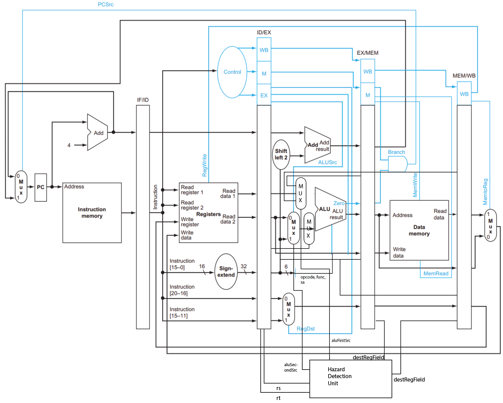
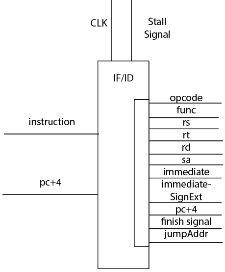
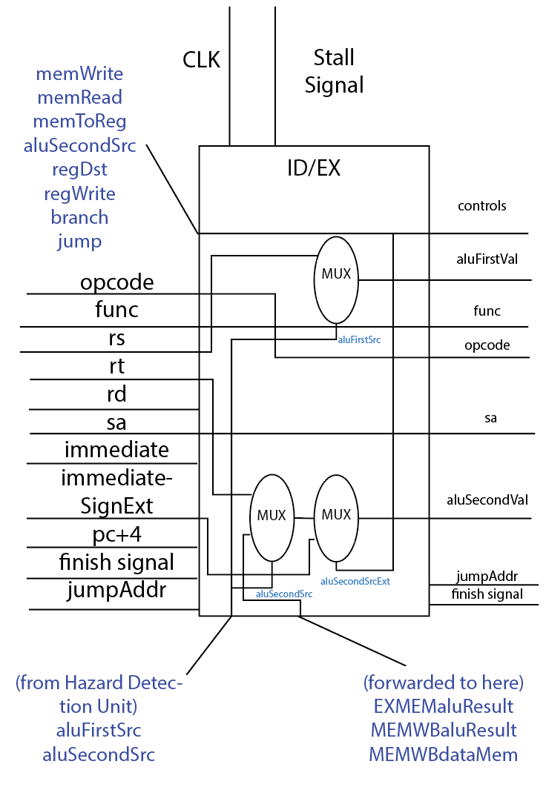
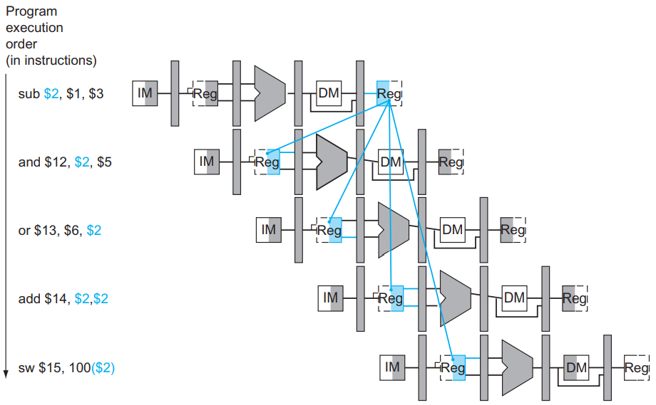
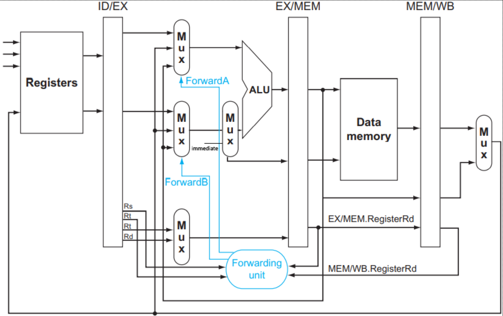

# MIPS Pipelined CPU
  
## 1. Overview
### What is this project
This project aims to build a 5-stage pipelined MIPS CPU using Verilog language. 
This CPU is able to execute MIPS instructions, also can retrieve and write to data memory. 
In this CPU, all data hazards and control hazard have been counter with my greatest care. 
This CPU is expected to execute instructions with the (possibly) fewest clock cycles in a 5-stage CPU, while dealing correctly with data and control hazards.

### How to run this project
This project requires `iVerilog` installed.
The inputs to this CPU is a file named `instructions.bin` with a set of binary MIPS codes.
To build and run it, directly use the `make` command, and it will show the memory dump on the screen after the commands are executed.
The total clock cycles used are also shown in the second line.
Also, there is a memory dump file generated called `memdump.txt` for later exmination, if needed.

### How does this CPU run
This CPU consists of 5 stages: The instruction memory, the register file read, the ALU, the register file write.

Between the 5 stages are 4 intermediate units with pipeline registers, they temporarily stores the information to be passed to the next stages. In my codes they are called "interfaces" because they are between stages.

They are: the `FetchDecodeInterface`, `DecodeExecuteInterface`, `ExecuteMemoryInterface`, `MemoryWriteBackInterface`. These interfaces receive previous "wires" signals, whether from previous interface or the previous stage, and put necessary ones to store in registers.

The DecodeExecuteInterface is combined with 2 multiplexors to select input to ALU; it also generates addresses for the branch and jump destinations.

This picture next page shows how exactly different components are put together.

### Overview of cycle punishments

- No punishment: data dependencies except for `lw`'s data dependency; `branch` if branch is not taken
- 1 cycle punishment: `lw` stall hazard; `j`, `jr`, `jal`; 
- 2 cycles punishment: `branch` if branch is taken

    Figure 1. The overall pipeline design, and signals

## 2. Files and what they do
### `InstructionRAM.v`, `RegisterFile.v`, `ALU.v` and `MainMemory.v`
These 4 files each represent one pipeline stage (the register file has both read and writeback stage). The `InstructionRAM.v` and `MainMemory.v` are files provided by instructors, with minor modifications on variable names. 

The `RegisterFile.v` has a module `RegisterFile`. It has 2 inputs regarding read: `firstRegNumber` and `secondRegNumber`. Its `firstVal` and `secondVal` registers will each present the accessed value. It has a `regWriteSignal` bit to control whether to write to register file, and a `writeData` which is the data. On positive edge clock, it will do the specified operation.

The `ALU.v` has the `ALU` module. It uses the `opcode`, `func`, `sa`(shift amount) fields of the instruction, rather than using ALUcontrols. It receives a `firstVal` and `secondVal`. On each positive clock edge,by the `opcode`, `func` and `sa`fields, it performs the specified calculations.

### `ControlUnit.v`
This file contains the `ControlUnit` module. 
This modules is not one of the stages, and does not take a `clk` for input. It is asynchronous.

The control unit, similar to `ALU.v`, takes `opcode` and `func` as inputs to determine the type of instruction. Its task is to generate the corresponding 1-bit control signals to control things like whether to write to memory, whether to write to register, whether to branch and jump, etc.

There are 8 1-bit control signals generated in this step:
- memWrite;    If asserted, write to data memory
- memRead;     If asserted, read from data memory
- memToReg;    If asserted, The value to reg write comes from memory; else from ALU
- aluSecondSrc;     If asserted, input from immediate field
- regDst;      If asserted, the register "write data" is rd(15:11); else rt(20:16)
- regWrite;    If asserted, the register will write data on the falling edge signal
- branch;      Is branch instruction (not including jump)
- jump;        Is jump instruction

### `CPU.v` and how to connect pieces together
The `CPU.v` file is the most important component of this project.
It not only contains the other 4 interfaces (like Decode/Execute interface) and the hazard detection unit, but most importantly connects every component, including the 5 stages, with interfaces and signals together.

#### Modules in `CPU.v`
> The `CPU` module  

This module sees the whole CPU design at a high level.
First, it maintains the program counter, incrementing, or assigning it to the branch or jump address at each `negative edge`. So that it will not affect the positive edge when pipeline stages are in progress. Then it connects every other module together with wires, forming the overall graph presented above. The details will be in the next section "Connecting modules together". Then, it "partially" handles hazrds of lw stall, branch and jump - these hazards does not require forwarding but require stalling. 

> The `FetchDecodeInterface`

This module:
- Receives the 32-bit instruction retrieved from instruction memory
- Splits the instruction into fields of `rs`, `rt`, `rd`, `immediate`, `sa`,`opcode`, `func`, or 26-bit `destinationAddress`
- Sign extends the immediate
- Determines by the instruction, if the instruction is `32'hffffffff`, the finish signal will be asserted

  
  &nbsp; &nbsp; &nbsp; &nbsp;&nbsp; &nbsp; &nbsp; &nbsp;&nbsp; &nbsp; &nbsp; &nbsp;
   

  
Figure 2. The `FetchDecodeInterface`&nbsp; &nbsp; &nbsp; &nbsp;&nbsp; &nbsp; &nbsp; &nbsp;&nbsp; &nbsp; &nbsp; &nbsp;Figure 3. The `DecodeExecuteInterface`

  

> The `DecodeExecuteInterface` module

This module: 
- Receives the `opcode`, `func`,`immediateSignExt` from `FetchDecodeInterface` and stores in registers
- Receives all signals passed from the `ControlUnit` and stores in registers
- Receives the data selector signals from the `HazardDetectionUnit`, and determines the operands to the `ALU`
- Receives the forwarded data (shown in figure 2)
- Generates the destination addresses for the `jr`, `jal` commands

> The `ExecuteMemoryInterface` module

This module is a simple module.
It uses registers to store control signals and data passed from ID/EX and ALU.
Also, it generates a control signal for the program counter - the pcSrc.
This 2-bit pcSrc is set together with the control signals: jump, and branch.
For example, if the `jump` control is 1, it will be set to `2'b10`.

> The `MemoryWriteBackInterface` module

This module is a simple module.
It uses registers to store control signals and data passed from Data Memory and EX/MEM.
Also, it detects the `finish` signal.
When the `finish` signal turns to 1, it will terminate the program.

<!-- #### Connecting modules together
One design approach in this project is, in this whole CPU design, we directly access fields of modules instead of wiring them to the output. This saves code and make things more direct. For example, when connecting wires to the ALU module, I wrote:

      ALU alu(clk, idex.aluFirstVal, idex.aluSecondVal, idex.func, idex.opcode, idex.sa);

(idex for instruction decode-execute interface)

With this approach, I connect modules together like in the code example above. -->

## 3. Handling hazards and forwarding; Evaluating the performance

### Overview of performance
As mentioned, this CPU is built to counter any data or control hazards successfully with the fewest clock cost I can. These countered hazards include:

Data hazards with forwarding:
- Case 1: MEM/WB.destination register = ID/EX.register rs
- Case 2: MEM/WB.destination register = ID/EX.register rt
- Case 3: EX/MEM.destination register = ID/EX.register rs
- Case 4: EX/MEM.destination register = ID/EX.register rt
- Case 5: `jr` command's data dependency

Control hazards: 
- Branch hazard: We **assume branch not taken and continue execution**; However, when the branch is taken, we eliminate the executed ones' impact

Others:
- `lw` stall hazard: first stall for 1 cycle, then the data will be forwarded
- `j`, `jr`, `jal`: make the next fetched instruction an `nop`; and then process ordinarily; This has punishment for 1 cycle

### Forwarding: Countering data hazards

The data hazards are counter using forwarding.
These data hazards are detected using the `HazardDetectionUnit`, and the `HazardDetectionUnit` passes the control signals of `aluFirstSrc`, `aluSecondSrc` to `DecodeExecuteInterface` to determine whether the data comes from register file, or directly from `EX/MEM` or `MEM/WB`. This forwarding does not punish the cycle.

  
    

    Figure 4. Illustration of forwarding

  
    

    Figure 5. Implementing the forwarding signals

### Forwarding for `lw` instruction: How stalling is implemented
For `lw` instruction's data dependency, we stall one cycle and resume.

The stalling is achieved by preventing the PC register and the IF/ID pipeline registers from changing. To insert `nop`, we make the control signals of the IF/ID and the ID/EX do nothing (set all to 0).

### `branch` instructions
For branch instructions of `beq` and `bne`, we assume branch is not taken and move forward. 

However, when the branch is taken, which can be telled in the `EX/MEM` stage's `aluResult`, there are 2 instructions already in the pipeline. In order to disable them, we override the control signals in the `ID/EX` stage to be `nop`s, and override the instruction in the `IF/ID` to be `nop`.

The net effect is that, 
- If the branch is not taken, no cycle punishment
- If the branch is taken, 2 cycles are punished